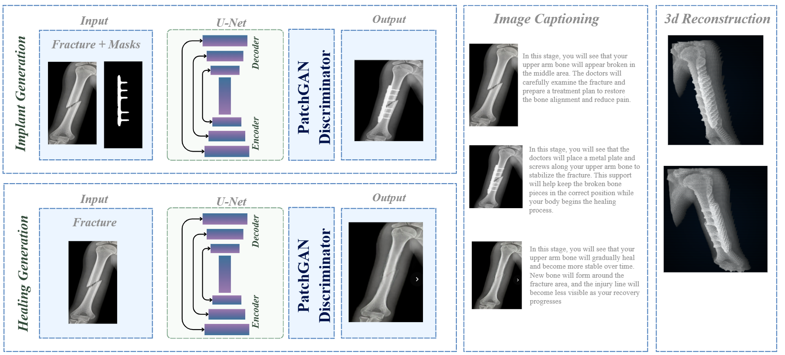
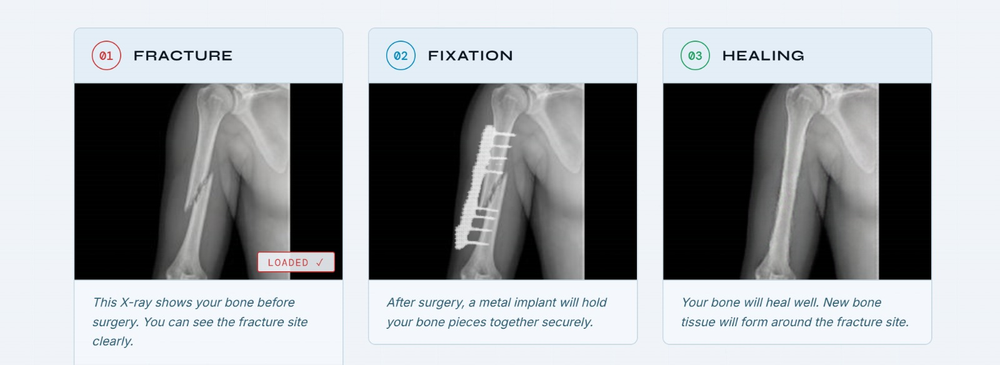
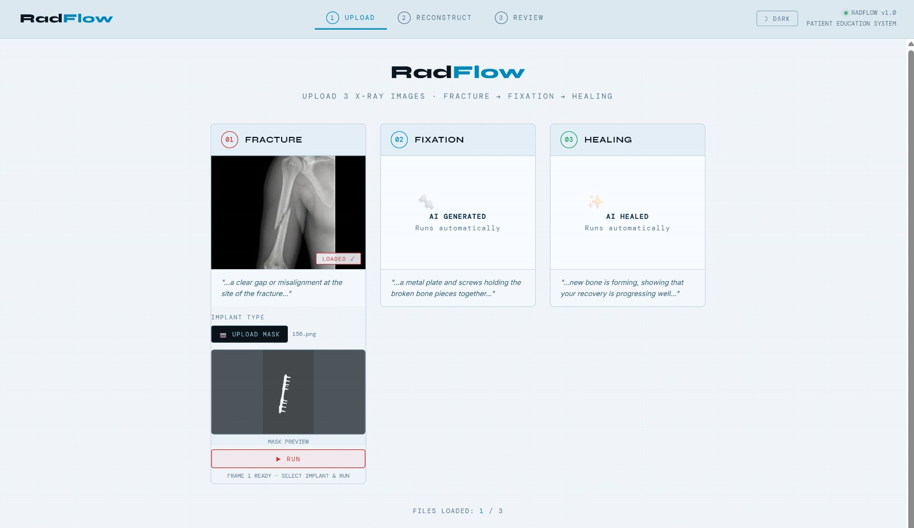
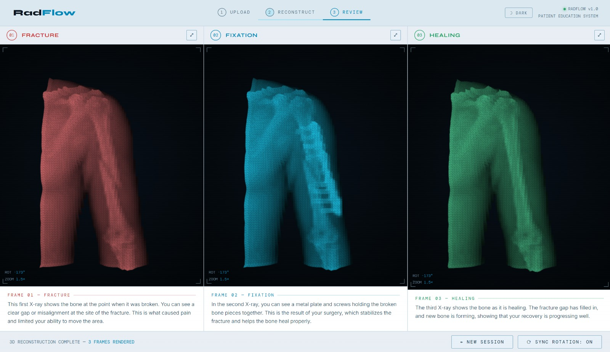

# RadFlow

AI-powered multimodal orthopedic visualization system for patient education and surgical understanding.

---

## Overview

RadFlow is an AI-driven educational system designed to improve patient understanding before orthopedic fracture surgeries.

The system transforms a single fracture X-ray into a sequential visualization pipeline that demonstrates:

1. Fracture condition  
2. Surgical fixation with implants  
3. Bone healing progression  

To enhance comprehension, the generated visual sequence is paired with:
- patient-friendly explanatory captions
- simplified 3D reconstruction
- multimodal educational visualization

The project focuses on reducing preoperative anxiety and improving communication between patients and clinicians through accessible AI-generated explanations.

---

# Main Pipeline

<p align="center">
  
</p>

The RadFlow pipeline combines:
- segmentation-guided implant generation
- healing-stage synthesis
- patient-friendly image captioning
- simplified 3D reconstruction

The system generates a complete orthopedic healing journey from a single fracture X-ray while preserving anatomical consistency and improving educational understanding.

---

# Demo Video

<p align="center">
  <a href="https://drive.google.com/drive/folders/1smtEcnoBsf3iA3AbAkmgPGKE9YfdgJaa?usp=sharing">
    
  </a>
</p>

Click the image above to watch the RadFlow demonstration video.

---

# Project Motivation

Preoperative anxiety is a common challenge in orthopedic fracture surgeries. Many patients struggle to understand radiographs and surgical procedures, especially fixation and healing stages.

Existing AI medical imaging systems are primarily designed for clinicians rather than patient-centered educational communication.

RadFlow addresses this gap by introducing a multimodal educational AI framework focused on improving procedural understanding through visual explanation.

---

# Key Features

- Sequential orthopedic X-ray generation
- Implant fixation visualization
- Healing-stage synthesis
- Segmentation-guided image generation
- Patient-friendly medical captioning
- Simplified 3D reconstruction
- Interactive educational visualization
- Orthopedic-focused AI workflow

---

# Interactive Interface

## Step 1 — Fracture Input

<p align="center">
  
</p>

The system begins with a fracture X-ray and implant mask selection.

The fracture region and implant guidance masks are used as spatial conditioning inputs for fixation generation.

---

## Step 2 — AI Generated Progression

<p align="center">
  
</p>

RadFlow generates:
- fixation-stage visualization
- healed-stage visualization
- educational medical explanations

The generated sequence provides patients with a simplified understanding of the surgical and recovery process.

---

# 3D Reconstruction

<p align="center">
  
</p>

RadFlow also generates simplified volumetric reconstructions from orthopedic X-rays to enhance spatial understanding of:
- fracture structure
- implant placement
- healing progression

The visualization interface supports:
- multi-frame reconstruction
- synchronized viewing
- educational comparison between stages

---

# Repository Structure

```text
RadFlow/
│
├── Module 1/
│   ├── Gen_implant.ipynb
│   └── Gen_healed.ipynb
│
├── Module 2/
│   └── EvalsAPI_Image_Captioning.ipynb
│
├── Module 3/
│   ├── Bone-journey-3-frames.html
│   └── one-frame-only.html
│
└── Preprocessing/
    ├── Training_Data_Preparation.ipynb
    ├── xray_augmentation.ipynb
    ├── YOLO11m_fine_tune_Bone.ipynb
    └── YOLO11m_fine_tune_Implant.ipynb
```

---

# Modules

## Module 1 — Generation

This module focuses on:
- implant insertion generation
- healing-stage synthesis
- segmentation-guided generation
- U-Net + PatchGAN architectures

The pipeline preserves global bone structure while generating localized implant and healing outcomes.

### Core Components
- U-Net Generator
- PatchGAN Discriminator
- Bone mask conditioning
- Implant mask guidance

---

## Module 2 — Captioning

This module handles:
- patient-friendly medical explanations
- multimodal caption generation
- image caption evaluation

The generated captions simplify radiological interpretation for non-medical users while preserving educational meaning.

---

## Module 3 — Visualization

This module contains:
- HTML educational interfaces
- sequential fracture journey visualization
- interactive reconstruction display

It demonstrates fracture → fixation → healing progression in an accessible patient-oriented workflow.

---

## Preprocessing

This folder includes:
- dataset preparation
- augmentation
- segmentation training
- validation workflows

### Included Tasks
- X-ray preprocessing
- augmentation
- bone segmentation
- implant segmentation
- dataset refinement

---

# Dataset

The dataset was constructed using sequential orthopedic radiographs collected from:
- educational radiology websites
- published medical research articles

Additional healed-stage samples were synthesized using generative AI tools to improve sequence consistency and anatomical alignment.

### Dataset Statistics

| Dataset | Samples |
|---|---|
| Original Dataset | 171 |
| Augmented Dataset | 855 |
| Validated Fixation Dataset | 668 |
| Healing Dataset | 811 |

---

# Segmentation

Fine-tuned YOLOv11 segmentation models were developed to generate:
- bone masks
- implant masks

These masks were used as spatial guidance during the generation process.

### Key Findings
- Separate models improved segmentation quality
- YOLO11m-seg achieved the strongest performance
- Fine-tuning improved implant localization
- Generated masks improved structural consistency

---

# Architecture

RadFlow uses a multimodal generative framework based on:
- U-Net architectures
- PatchGAN discriminators
- segmentation-guided synthesis
- multimodal conditioning

The system preserves:
- global skeletal integrity
- localized implant realism
- temporal visual consistency

through conditioning mechanisms and guided generation strategies.

---

# Results

Experimental evaluation demonstrated:

- Realistic implant placement
- Anatomical consistency preservation
- Plausible healing-stage generation
- Improved patient-friendly captioning
- Stable simplified 3D reconstruction outputs

### Quantitative Highlights

- Healing generation achieved mean SSIM ≈ 0.727
- Orthopedic specialists considered outputs acceptable for educational purposes

---

# Technologies & Frameworks

- Python
- PyTorch
- YOLOv11
- OpenAI Evals
- Jupyter Notebook
- Computer Vision
- Generative AI
- Medical Imaging
- HTML/CSS
- U-Net
- PatchGAN

---

# Future Work

- Expand real-world orthopedic datasets
- Improve 3D reconstruction realism
- Support additional fracture types
- Build fully interactive patient education interfaces
- Add multilingual caption generation
- Improve temporal consistency across generated sequences

---

# Team

| Name | Role |
|---|---|
| [Hareer Alnamassi](https://www.linkedin.com/in/hareer-alnamassi?utm_source=share_via&utm_content=profile&utm_medium=member_ios) | Project Lead |
| [Ghaida Alsabti](https://www.linkedin.com/in/ghaida-alsabti-8283b9279?utm_source=share_via&utm_content=profile&utm_medium=member_ios) | AI Development |
| [Nada Almutairi](https://www.linkedin.com/in/nada-almutairi-9544aa290?utm_source=share_via&utm_content=profile&utm_medium=member_ios) | AI Development |
| [Norah Almezied](https://www.linkedin.com/in/norah-almezied-738429385?utm_source=share_via&utm_content=profile&utm_medium=member_ios) | AI Development |

### Supervisor
Prof. Wided Abd. Lejouad Chaari

---

# Disclaimer

This project is intended for educational and research purposes only.

It is not designed for medical diagnosis, surgical planning, or clinical decision-making.